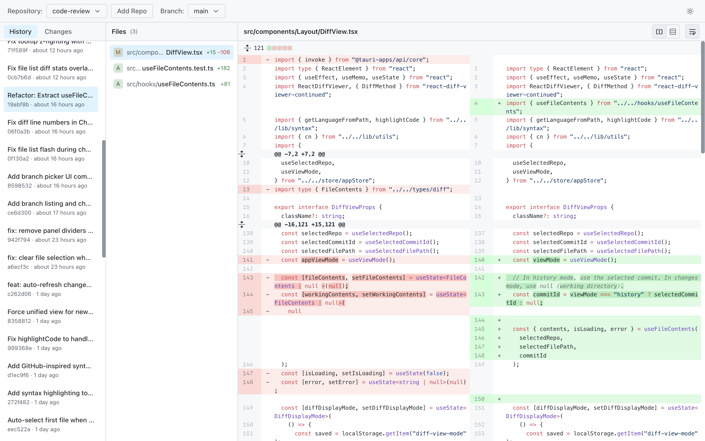

# Recap

A desktop app for reviewing Git commits and changes.




## Features

- **Multi-repo support** — Add and switch between repositories
- **Commit history** — Browse commits with messages and timestamps
- **Diff viewer** — Split or unified view with syntax highlighting (coming soon)
- **Working changes** — View staged and unstaged modifications
- **Native performance** — Rust-powered Git operations via libgit2

## Quick Start

```bash
# Install dependencies
bun install

# Run in development
bun run tauri dev

# Build for production
bun run tauri build
```

## Tech Stack

| Layer    | Technology                          |
| -------- | ----------------------------------- |
| Frontend | React 19, TypeScript, Tailwind CSS  |
| Backend  | Tauri 2.0, Rust, git2               |
| State    | Zustand                             |
| UI       | Radix UI, react-resizable-panels    |
| Testing  | Vitest, React Testing Library       |
| Linting  | Biome (via Ultracite)               |

## Development

```bash
bun run test      # Run tests
bun run lint      # Lint with Biome
bunx biome check  # Check formatting
```

## Project Structure

```
src/
├── components/     # React components
│   ├── Layout/     # Main app layout (Sidebar, FileList, DiffView)
│   └── Toolbar/    # Toolbar components (RepoPickerButton, AddRepoButton)
├── store/          # Zustand state management
├── hooks/          # Custom React hooks
└── types/          # TypeScript types

src-tauri/
└── src/
    ├── git.rs      # Git operations (commits, diffs, file status)
    ├── lib.rs      # Tauri commands
    └── main.rs     # App entry point
```

## License

MIT
